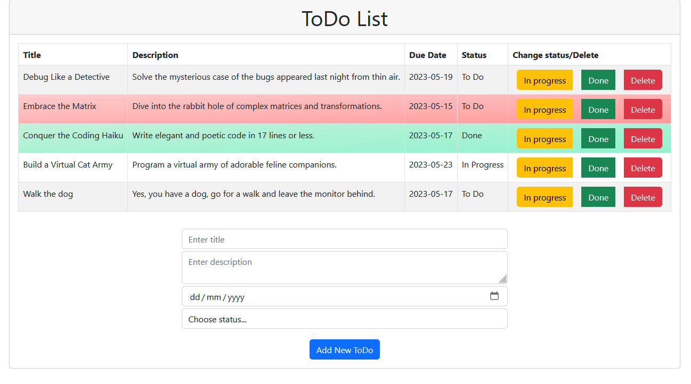

# ToDo List React App

        Under development

This is a simple React application that is for practising the use of React Context and Reducer for state management.
The app allows users to add, edit the status, and delete todos. Each todo can have a title, description, due date, and status. The status of the todo can be changed by clicking the "In Progress" or "Done" buttons. Todos can be deleted by clicking the delete button.



## Getting Started

1. To run the app locally, clone the repository to your local machine:

```git clone https://github.com/your-username/react-todo-list.git```

2. Navigate to the project directory:

```cd todo-list-app```

3. Start the app:

```npm start``` or ```yarn start```

4. This will start the app in development mode and open it in your default browser at http://localhost:3000.

## Usage

1. To add a new todo, fill out the form with the title, description, due date and status. Click "Add New Todo" to add the todo to the list.
2. To change the status of a todo, click the "In Progress" or "Done" button next to the todo. The status will update.
3. To delete a todo, click the "Delete" button next to the todo. The todo will be removed from the list.

## License

This project is licensed under the MIT License.
