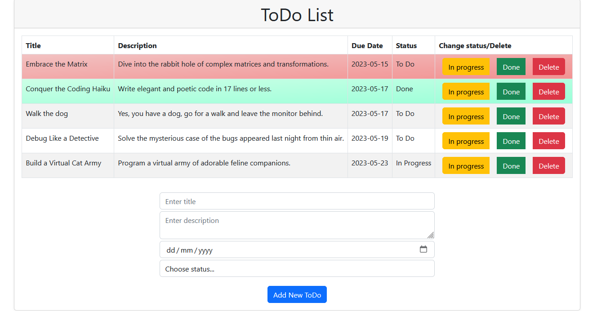
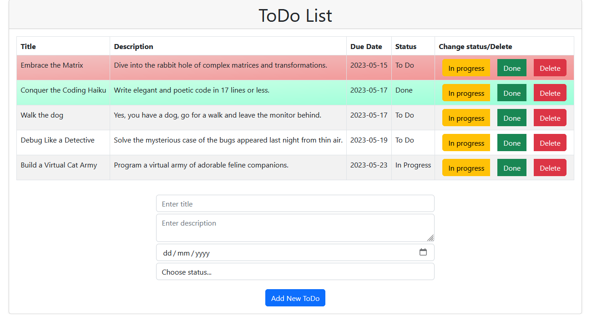

# ToDo List React App

## Description

This ToDo List App is a simple **React** application designed for practicing the use of **Context** and **Reducer** for efficient state management. It additionally incorporates hooks such as the **useLocalStorage, useEffect, useState** and **Bootstrap** for enhanced user experience.

Each to-do item consists of a title, description, due date, and status. Users can add new tasks, edit the status of existing tasks, and delete tasks as needed.

The status of each to-do can be modified by simply clicking the "In Progress" or "Done" buttons. Tasks that are overdue based on their due dates but have not yet been completed will be visually highlighted in red, allowing users to prioritise their work effectively. Completed tasks are highlighted in green, providing a clear indication of their status.

The app also offers a sorting feature, by clicking on the "Due Date" table header.

The useLocalStorage hook ensures persistent storage, allowing users to resume their to-do list management even after closing the browser or restarting the application. The app remembers the state of the to-do list, ensuring that tasks are listed as they were during the last session.

## Features

* Add new todos with a title, description, due date, and initial status.
* Edit the status of todos by marking them as "In Progress" or "Done".
* Delete todos that are no longer needed.
* Highlight overdue todos in red and completed todos in green for easy identification.
* Sort todos based on their due date for better organisation.
* Persistent storage for todos

## Screenshots

New ToDos added and listed.


Clicking on the Due Date header enables the sorting of added ToDos.



Upon reopening the application, the todos are retrieved from the local storage.


## Getting Started

1. To run the app locally, clone the repository to your local machine:

```git clone https://github.com/your-username/react-todo-list.git```  

2. Navigate to the project directory:

```cd react-todo-list```  

3. Start the app:

```npm start``` or ```yarn start```  

4. This will start the app in development mode and open it in your default browser at http://localhost:3000.


## License

This project is licensed under the MIT License.
