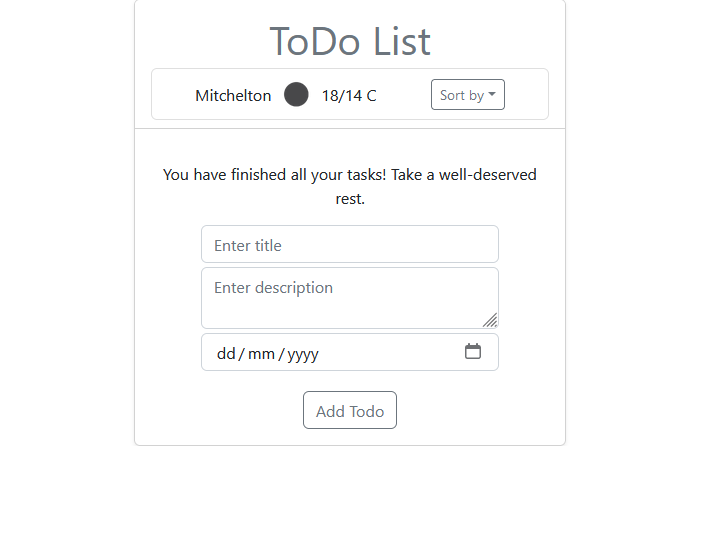
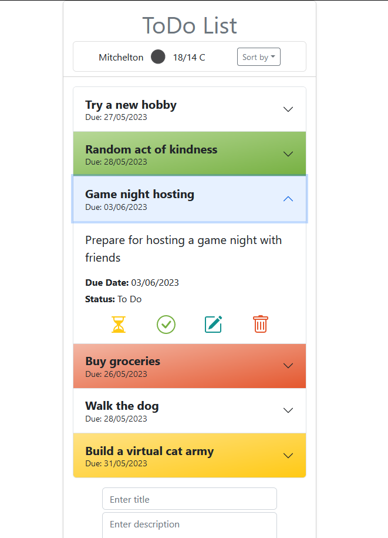

# ToDo List React App

## Description

This ToDo List App is a simple **React** application designed for practicing the use of **Context** and **Reducer** for efficient state management. It additionally incorporates hooks such as the **useLocalStorage, useEffect, useState** and **Bootstrap** for enhanced user experience.

Each to-do item consists of a title, description, due date, and status (upon adding the task, the status automatically gets the To Do value). Users can add new tasks, edit the status of existing tasks, and delete tasks as needed.

Accordion component is used to display the list of tasks in a collapsible and expandable format to support mobile view rendering. Clicking on an accordion item's header toggles its expanded/collapsed state. This allows users to easily view and manage individual tasks. The status of each to-do can be modified in the expanded view of the accordion by simply clicking on icons (i.e. hourglass icon is for in progress status, trash bin icon is for delete etc.)
To enhance the user experience, the accordion's header's background color changes dynamically based on the task's status (e.g., overdue (red), done (green), in progress (yellow)).

The useLocalStorage hook ensures persistent storage, allowing users to resume their to-do list management even after closing the browser or restarting the application. The app remembers the state of the to-do list, ensuring that tasks are listed as they were during the last session.

## Features

* Add new todos with a title, description and due date.
* Edit the status of todos using icons: the hourglass icon (yellow) represents 'in progress,' the tick in the circle icon (green) represents 'done,'
* Delete todos using the red trash bin icon
* Highlight overdue todos in red, completed todos in green and in progress todos in yellow for easy identification
* Persistent storage for todos

## Demo

Check out the deployed app at https://todo-list-react-k.netlify.app

## Screenshots

| Desktop | Mobile |
|---------|---------|
|  |  |
|  |  |
|  |  |


## Getting Started

1. To run the app locally, clone the repository to your local machine:

```git clone https://github.com/your-username/react-todo-list.git```  

2. Navigate to the project directory:

```cd react-todo-list```  

3. Start the app:

```npm start``` or ```yarn start```  

4. This will start the app in development mode and open it in your default browser at http://localhost:3000.


## License

This project is licensed under the MIT License.
