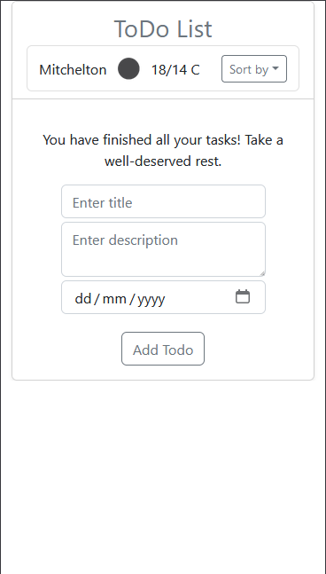
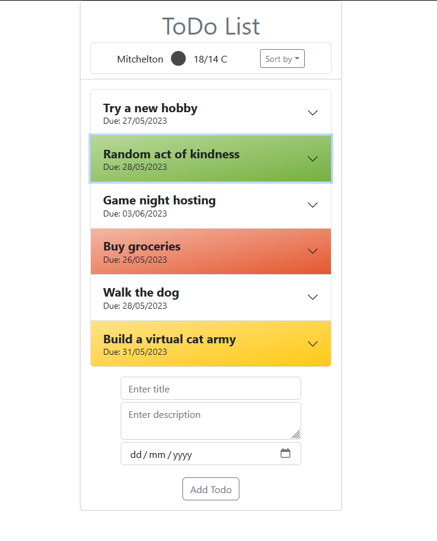
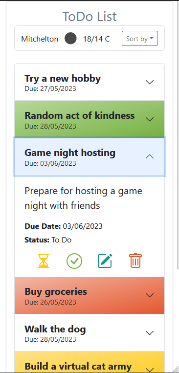
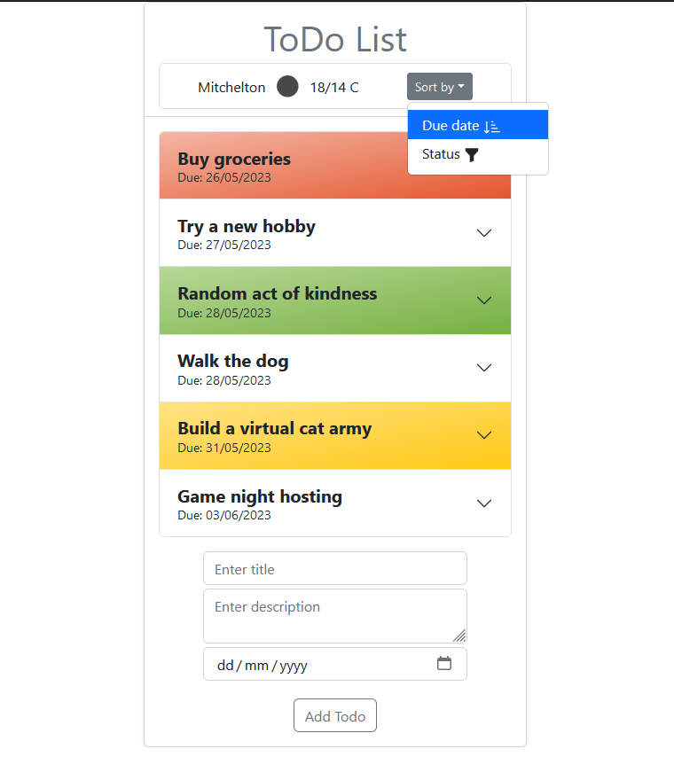
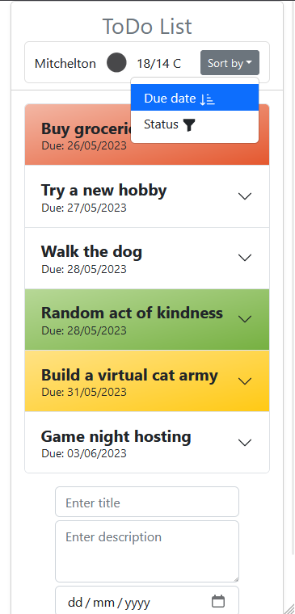
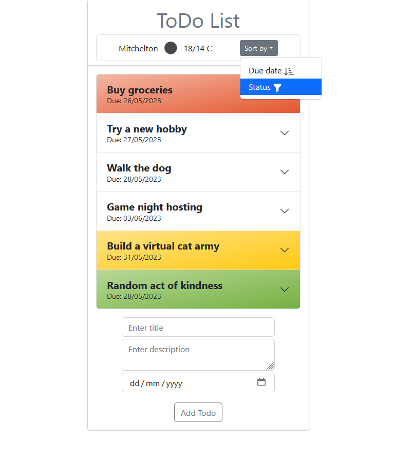
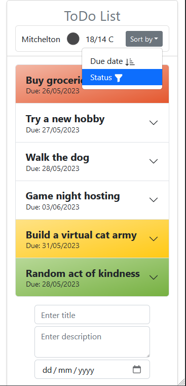
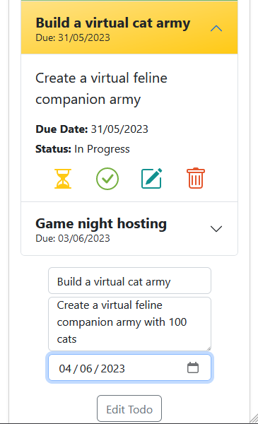
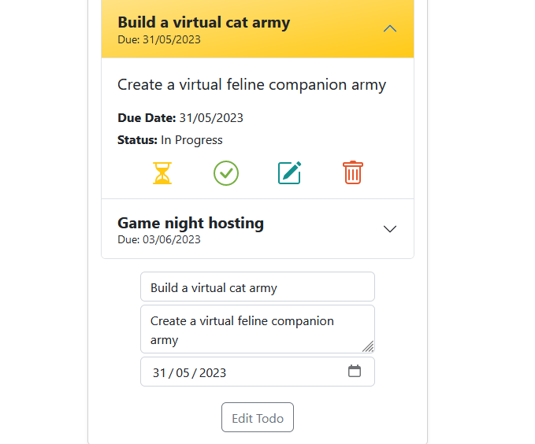
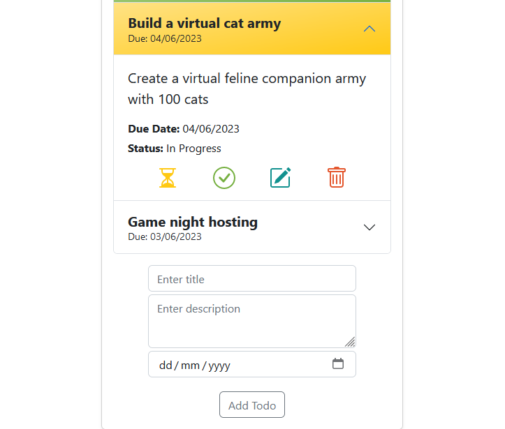

# ToDo List React App

## Description

The ToDo List App is a **React** application specifically designed to facilitate the practice of efficient state management using **Context** and **Reducer**. It leverages various hooks such as **useLocalStorage, useEffect, useState**, and **Bootstrap** to provide an enhanced user experience. To ensure the security of sensitive data, the app integrates **netlify functions**, which store the API key as an environment variable and guarantee its protection.

In the header section of the app, users can find buttons for sorting their todos based on due dates and statuses. Moreover, the app displays weather details according to the device's location. In case geolocation is inaccessible, default information is presented instead.

Each to-do item consists of a title, description, due date, and status. By default, a newly added task is assigned the "To Do" status. Users have the flexibility to add, edit, and delete tasks as required.

Accordion component is used to display the list of tasks in a collapsible and expandable format to support mobile view rendering. Toggling the header of an accordion item expands or collapses its content, enabling users to view and manage individual tasks. The expanded view of the accordion allows for seamless modification of each to-do item by utilising intuitive icons (e.g., the hourglass icon signifies "In Progress", the tick in the circle used for "Done"items, a pencil on paper icon indicates editing of task properties, and a trash bin icon represents deletion).

To improve the user experience, the accordion's header's background color changes dynamically based on the task's status (e.g., overdue (red), done (green), in progress (yellow)).

The useLocalStorage hook ensures persistent storage, allowing users to resume their to-do list management even after closing the browser or restarting the application. The app remembers the state of the to-do list, assuring that tasks are listed as they were during the last session.

Weather information is updated regularly, either every hour, upon manual refresh, or when the user returns to the application. This guarantees that the weather details remain current and accurate.

## Features

* Add new todos with a title, description and due date.
* Sort todos based on due dates and statuses (To Do prioritised first, then In Progress and Done last). Within each status, todos are further sorted based on due dates i.e. overdue items will be listed first.
* The weather data display updates every hour, providing users with the most up-to-date information.
* Edit todos by simply clicking on the editing icon. The respective todo is loaded into the form, and the button transforms into "Edit Todo" instead of "Add Todo." After the necessary modification has been made, click on the "Edit Todo" button to save the changes. As a result, the todo display will automatically update with the new information.
* Manage the status of todos using intuitive icons: The yellow hourglass icon represents tasks "In Progress," while the green tick in the circle icon signifies tasks that are "Done."
* To delete todos use the red trash bin icon
* To enhance visibility and for ease of identification highlighting of overdue todos in red, completed todos in green, and in-progress todos in yellow are applied.
* Persistent storage for todos allowing users to resume their task management from where they left off, even after closing the application.

## Demo

Check out the deployed app at https://todo-list-react-k.netlify.app

## Screenshots

| Desktop | Mobile |
|---------|---------|
|Starting page||
|  |  |
|ToDos display||
|  |  |
|Opened ToDo||
|  |  |
|Sorted by due date||
|  |  |
|Sorted by status||
|  |  |
|Edit todo||
|  |  |
|  |  |
|  |  |


## Getting Started

Follow these steps to run the app locally:

1. Clone the repository to your local machine:

```git clone https://github.com/your-username/react-todo-list.git```  

2. Navigate to the project directory:

```cd react-todo-list```  

3. Install the necessary dependencies:

```npm install```

4. To use the application locally, an API Key needs to be requested from the [OpenWeatherMap](https://openweathermap.org/) site and utilise.

5. Start the app:

```npm start```

6. This will launch the app in development mode and automatically open it in your default browser at http://localhost:3000.


## License

This project is licensed under the MIT License.
